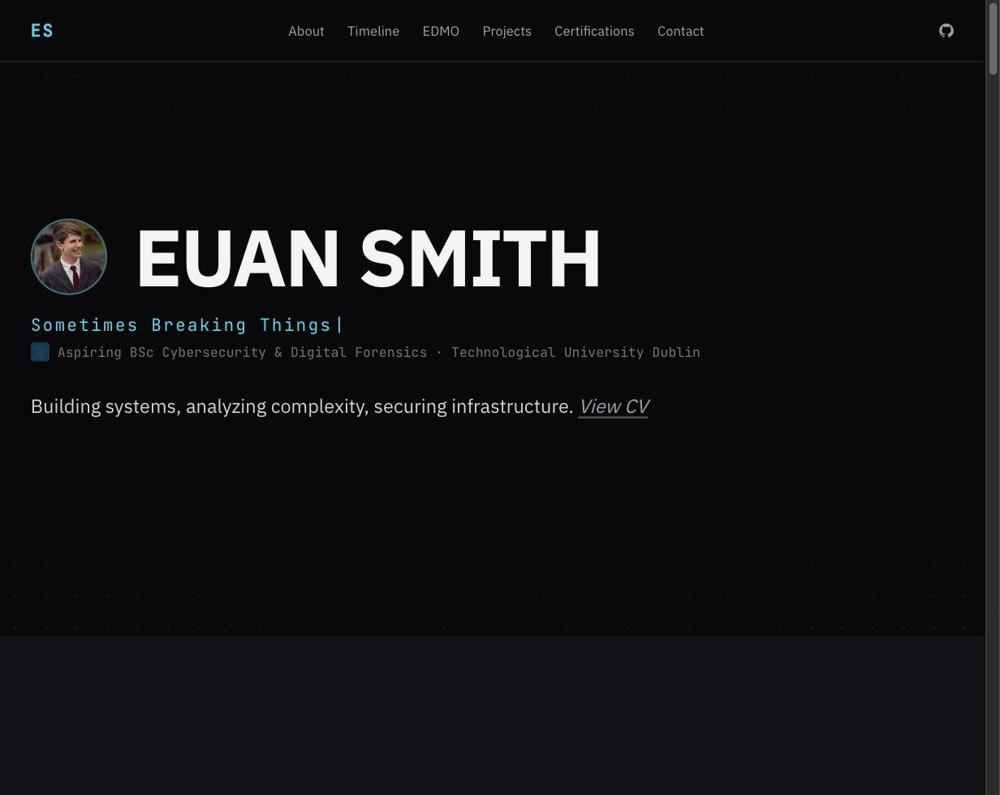

<div align="center">

# [euansmith.net](https://euansmith.net)



</div>

My portfolio site. Cybersecurity student, occasional web dev, apparently also a "digital analyst" depending on which rotating title you catch it on.

Opens with a fake terminal breach sequence before the actual page loads. Press any key to skip it if you're not in the mood.

## Running it locally

```bash
git clone https://github.com/EuanSmith2/Personal-Website-v2.git
cd Personal-Website-v2
npm install
npm run dev
```

Then open `http://localhost:3000`. No env vars, no API keys, no external services to sign up for — it's Next.js (App Router, v15) with Tailwind for styling, Framer Motion and GSAP doing the animation work, and a small library called `use-scramble` for the glitch effect on the name and the rotating titles.

Nothing's wired to a CMS or a database. Every bit of content — timeline, projects, certs, the about text — lives in one file: `src/data/portfolio.config.ts`. Swapping a project or adding a cert means editing that file and saving. No Sanity, no Contentful, no migrations.

## What's on it

About, a timeline, the EDMO research work, three projects (RadicalMap, a marketplace intelligence system, an AI sandbox), certs, and a CV page that renders a PDF live instead of serving a static one that goes stale the next time something changes. Email on the contact section is obfuscated so it doesn't get scraped.

## License

CC0 — do what you want with it.
